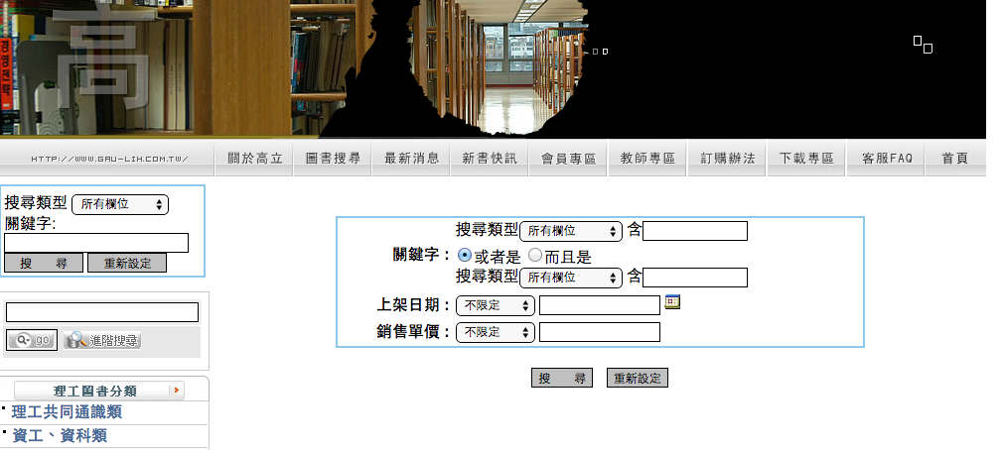
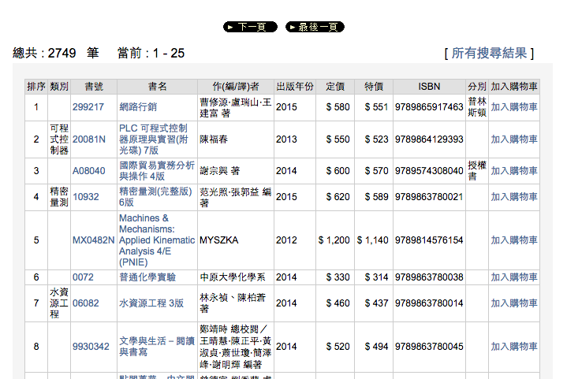
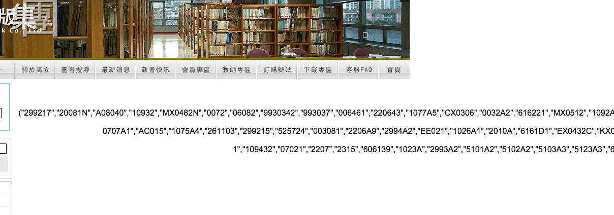
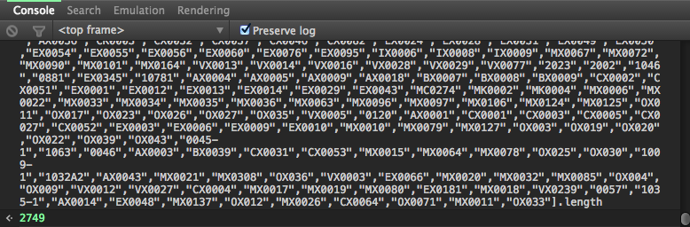
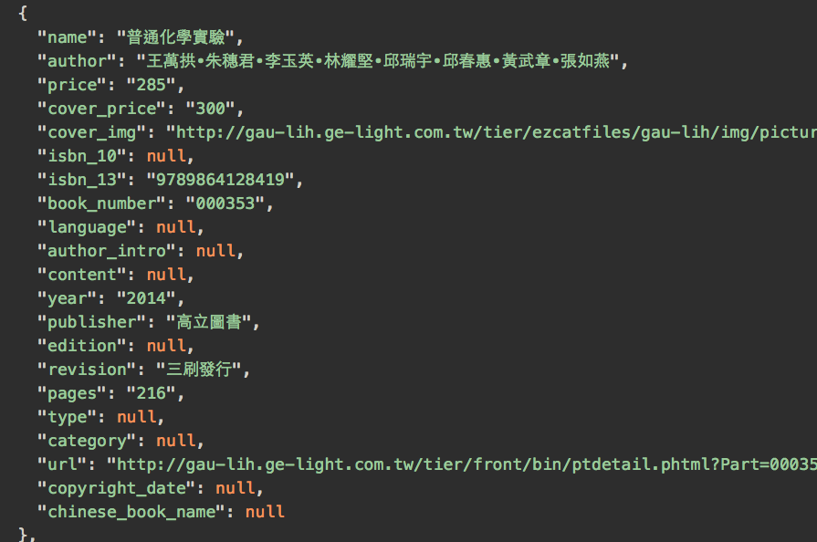

寫一個爬蟲之二
------------
在跟兜大聊完之後得知在資料檢索的時候，得知在資料檢索領域，一般會把程式分成兩部分，一為 *Crawler*，也就是俗稱的爬蟲，將每一個需要的頁面下載下來，另外一部分為 *Parser* ，翻成解析器，負責將載下的網頁截取出需要的部分。

啊當然 ruby 在這兩個方面還是很好用的，以下在記錄下過程。

##要抓哪些資料？
以這次的問題為例，我必須將各大教科書出版社放在網路上的書抓回來，建立我們自己的資料庫。稍微翻了幾個出版商的網站後，發現[高立圖書](http://gau-lih.ge-light.com.tw/tier/)的資料算是超好爬的，就直接拿他先開刀了。

先找到高立[圖書檢索](http://gau-lih.ge-light.com.tw/tier/front/bin/advsearch.phtml)的頁面

慣用的伎倆就是「搜尋空字串」，直接按下`搜尋`囉～

出來啦～～不過可惜的是，是一頁一頁分的，看了下換頁是經典的換頁javascript，好麻煩，還得分頁Post。不過右上角怎麼有個*所有搜尋結果*咧？點進去一看，Bingo！

這啥毀啊～XDD，定睛一看，看似陣列，複製起來貼上到Chrome Developer Console，看看size吧：

2749！剛好跟搜尋結果量一樣。應該就是每本書的編號了，分析下每本書的url：

    http://gau-lih.ge-light.com.tw/tier/front/bin/ptdetail.phtml?Part=書的編號

結束這回合。

##怎麼抓？
再利用 `wget` 抓完每個頁面後，一貫的使用 Nokogiri 解析後，卻發現怎麼也找不到網頁下方的表格。最後發現是編碼，可以參考[[Ruby]編碼學問很大](http://blog.sammylin.tw/nokogiri-encoding/)這篇文章解決。補充那篇文章， iconv 是 gem，記得裝。

剩下來就是各種 CSS Selector 語法、字串解析了。詳見 [parser.rb](https://github.com/yukaihuang1993/GaoLiBooks/blob/master/parser.rb)。

抓完大概長這樣，數 MB 的文字啊。

##比上次好的地方
* 物件更物件了
* JSON.pretty_generate !!
* 欄位看起來很精實(X)

##吐肚(TODOs)
* Parser 還是沒用 MultiThreading...所以很慢XD
* crawler 抓資料也不能太頻繁，不然會被 block，這次倒是還好。

